# HSYNC Synchronization Flow

This document describes how file synchronization works between clients through the HSYNC server.

> **Note**: Diagrams are written in Mermaid. If they don't render, run `./generate-diagrams.sh` to generate PNG images in the `images/` directory.

## Overview

HSYNC uses a combination of REST API for file transfers and WebSocket for real-time event propagation.

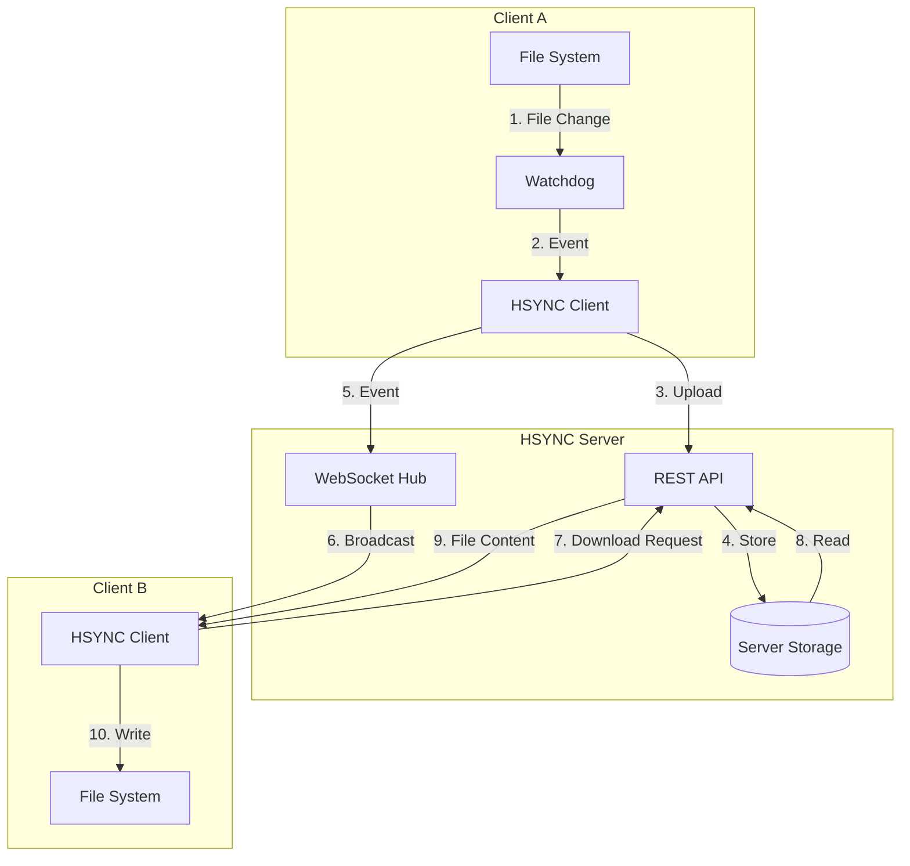
```mermaid
graph TB
    subgraph "Client A"
        FSA[File System]
        WDA[Watchdog]
        CA[HSYNC Client]
    end

    subgraph "HSYNC Server"
        REST[REST API]
        WS[WebSocket Hub]
        FSS[(Server Storage)]
    end

    subgraph "Client B"
        CB[HSYNC Client]
        FSB[File System]
    end

    FSA -->|1. File Change| WDA
    WDA -->|2. Event| CA
    CA -->|3. Upload| REST
    REST -->|4. Store| FSS
    CA -->|5. Event| WS
    WS -->|6. Broadcast| CB
    CB -->|7. Download Request| REST
    FSS -->|8. Read| REST
    REST -->|9. File Content| CB
    CB -->|10. Write| FSB
```

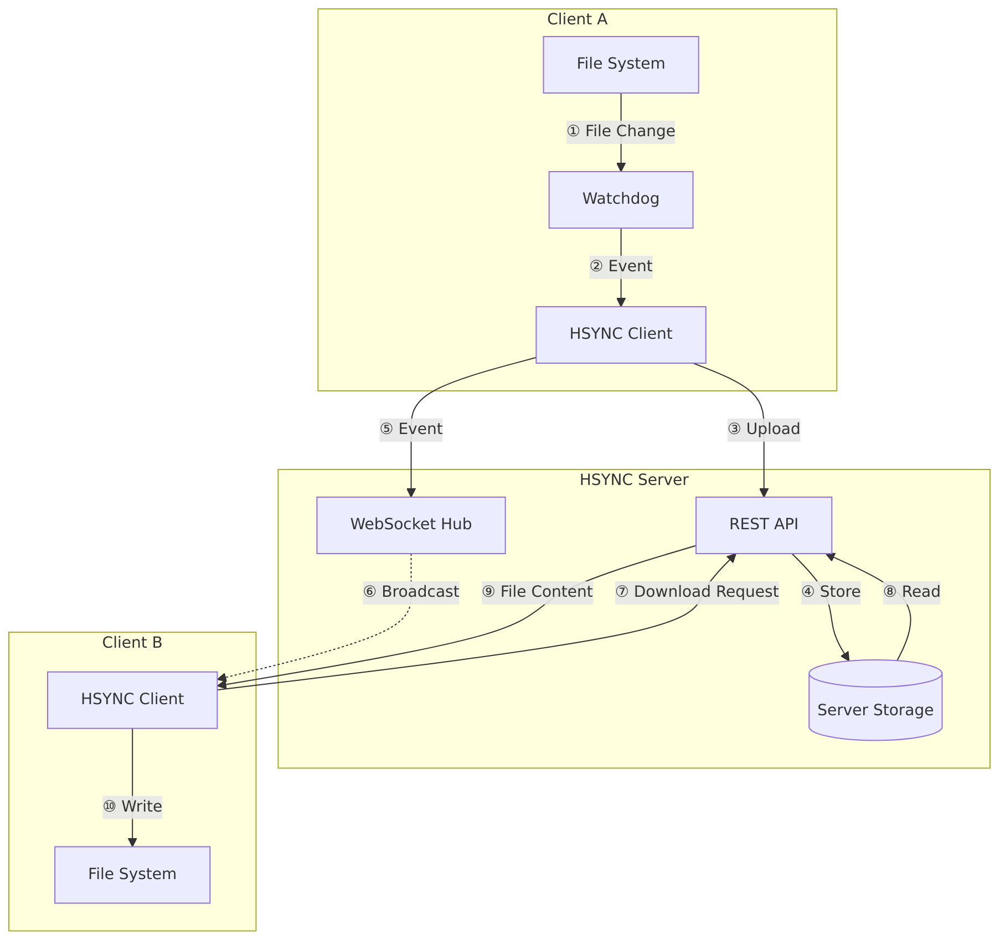

## Initial Synchronization

When a client starts, it performs a full sync to ensure consistency:

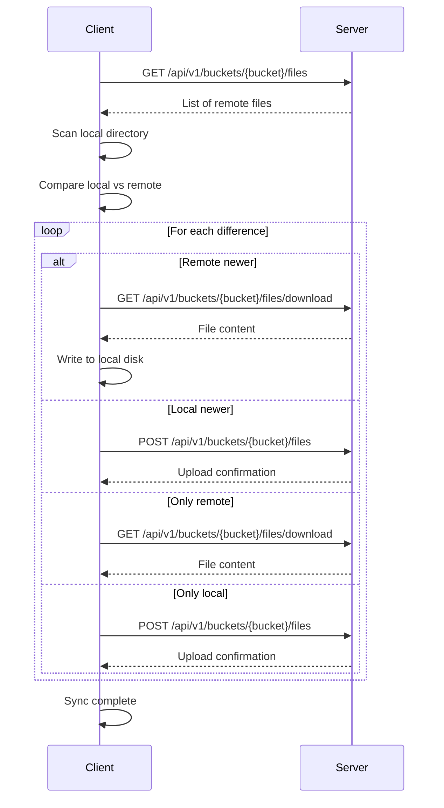
```mermaid
sequenceDiagram
    participant C as Client
    participant S as Server

    C->>S: GET /api/v1/buckets/{bucket}/files
    S-->>C: List of remote files
    
    C->>C: Scan local directory
    C->>C: Compare local vs remote
    
    loop For each difference
        alt Remote newer
            C->>S: GET /api/v1/buckets/{bucket}/files/download
            S-->>C: File content
            C->>C: Write to local disk
        else Local newer
            C->>S: POST /api/v1/buckets/{bucket}/files
            S-->>C: Upload confirmation
        else Only remote
            C->>S: GET /api/v1/buckets/{bucket}/files/download
            S-->>C: File content
        else Only local
            C->>S: POST /api/v1/buckets/{bucket}/files
            S-->>C: Upload confirmation
        end
    end
    
    C->>C: Sync complete
```

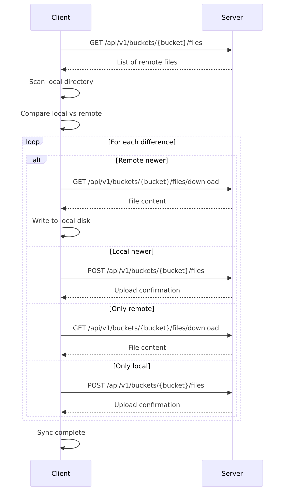

## Real-Time Synchronization (Watch Mode)

In watch mode, clients maintain a WebSocket connection for instant updates:

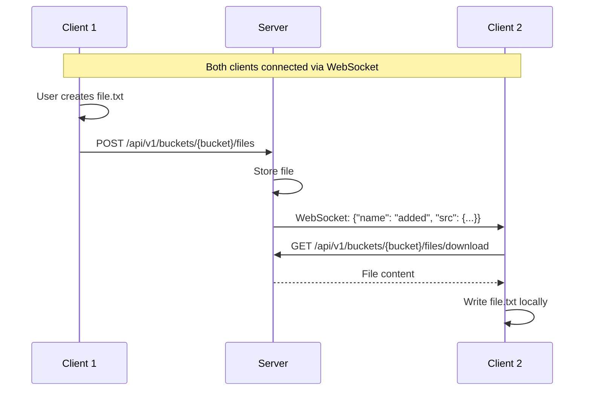
```mermaid
sequenceDiagram
    participant C1 as Client 1
    participant S as Server
    participant C2 as Client 2

    Note over C1,C2: Both clients connected via WebSocket

    C1->>C1: User creates file.txt
    C1->>S: POST /api/v1/buckets/{bucket}/files
    S->>S: Store file
    S->>C2: WebSocket: {"name": "added", "src": {...}}
    C2->>S: GET /api/v1/buckets/{bucket}/files/download
    S-->>C2: File content
    C2->>C2: Write file.txt locally
```

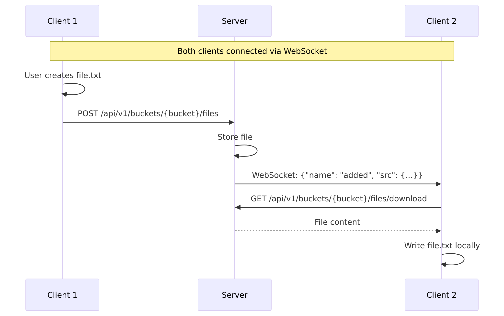

## Event Types and Actions

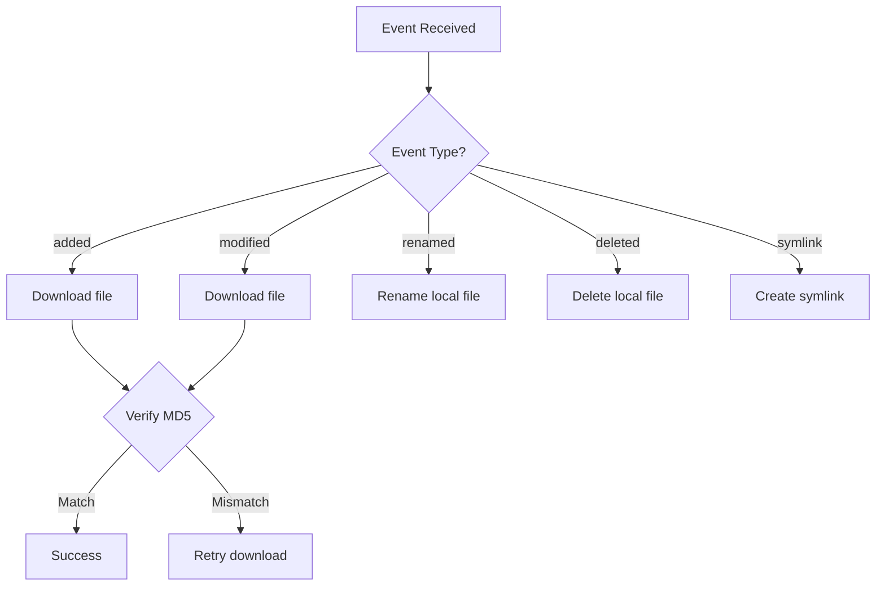
```mermaid
flowchart TD
    E[Event Received] --> T{Event Type?}

    T -->|added| A[Download file]
    T -->|modified| M[Download file]
    T -->|renamed| R[Rename local file]
    T -->|deleted| D[Delete local file]
    T -->|symlink| L[Create symlink]

    A --> V{Verify MD5}
    M --> V
    V -->|Match| S[Success]
    V -->|Mismatch| RE[Retry download]
```

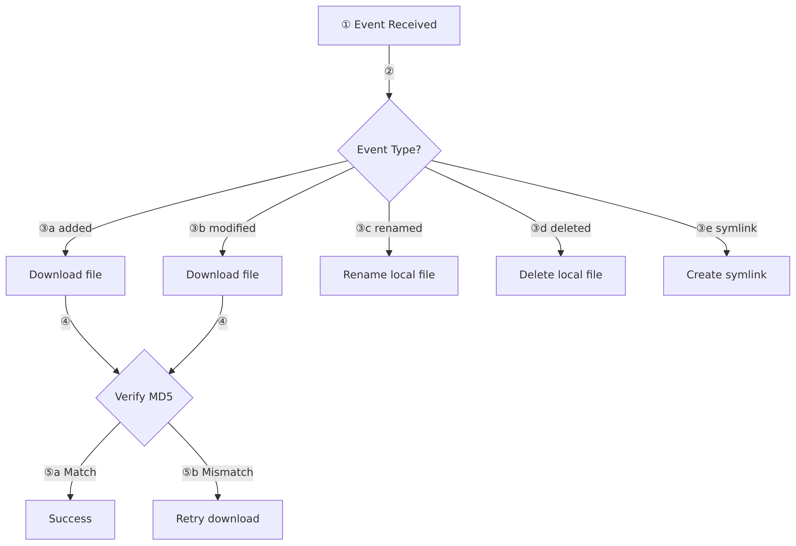

## Conflict Resolution

HSYNC uses "last write wins" based on modification time:

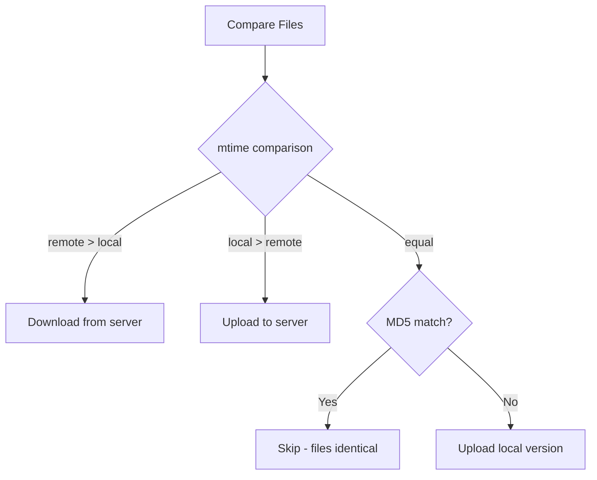
```mermaid
flowchart TD
    C[Compare Files] --> T{mtime comparison}
    
    T -->|remote > local| D[Download from server]
    T -->|local > remote| U[Upload to server]
    T -->|equal| H{MD5 match?}
    
    H -->|Yes| S[Skip - files identical]
    H -->|No| U2[Upload local version]
```

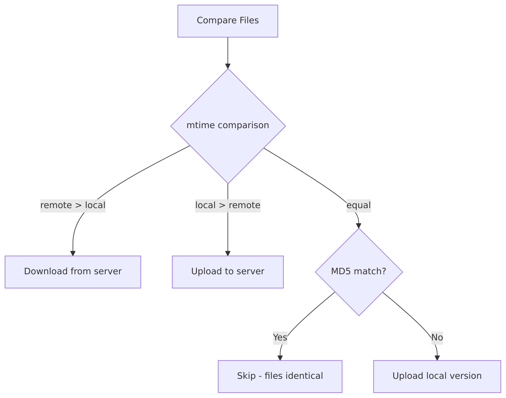

## Event Queue and Retry

The client uses an event queue with exponential backoff for reliability:

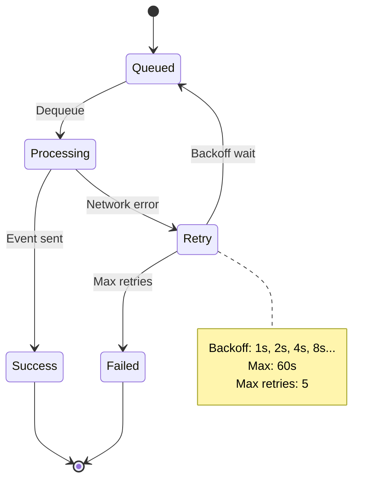
```mermaid
stateDiagram-v2
    [*] --> Queued
    Queued --> Processing: Dequeue
    Processing --> Success: Event sent
    Processing --> Retry: Network error
    Retry --> Queued: Backoff wait
    Retry --> Failed: Max retries
    Success --> [*]
    Failed --> [*]

    note right of Retry
        Backoff: 1s, 2s, 4s, 8s...
        Max: 60s
        Max retries: 5
    end note
```

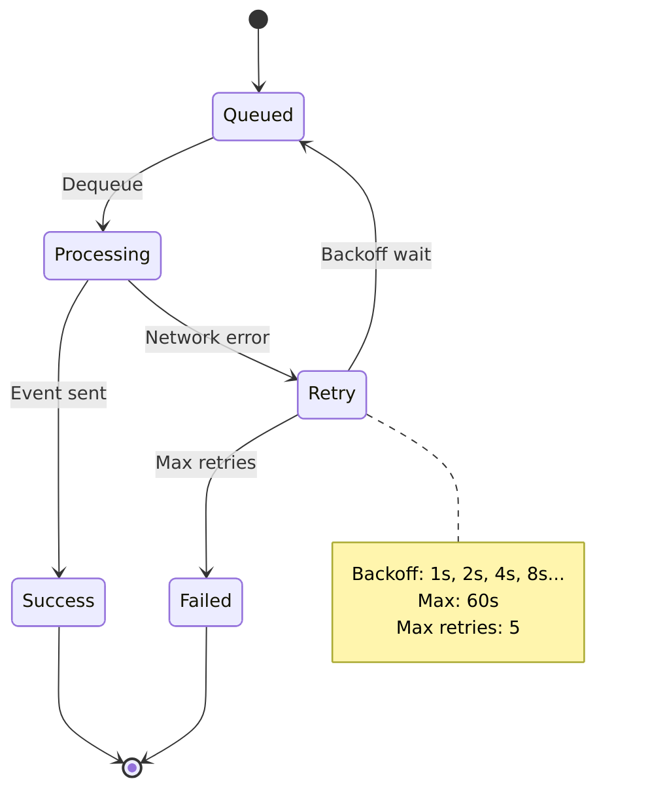

## Connection Recovery

When the WebSocket connection is lost:

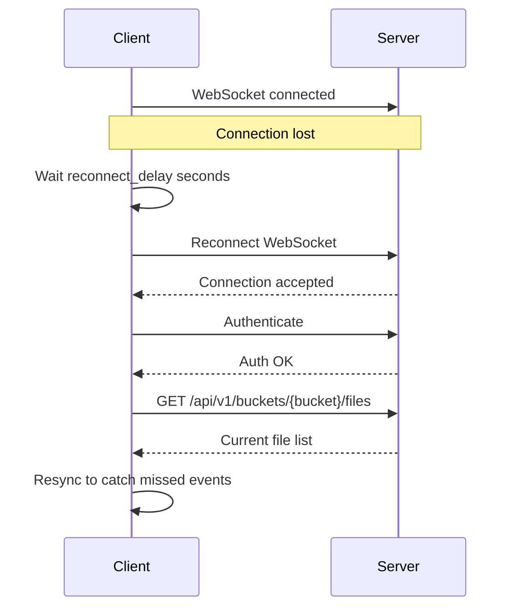
```mermaid
sequenceDiagram
    participant C as Client
    participant S as Server

    C->>S: WebSocket connected
    Note over C,S: Connection lost

    C->>C: Wait reconnect_delay seconds
    C->>S: Reconnect WebSocket
    S-->>C: Connection accepted
    C->>S: Authenticate
    S-->>C: Auth OK

    C->>S: GET /api/v1/buckets/{bucket}/files
    S-->>C: Current file list
    C->>C: Resync to catch missed events
```

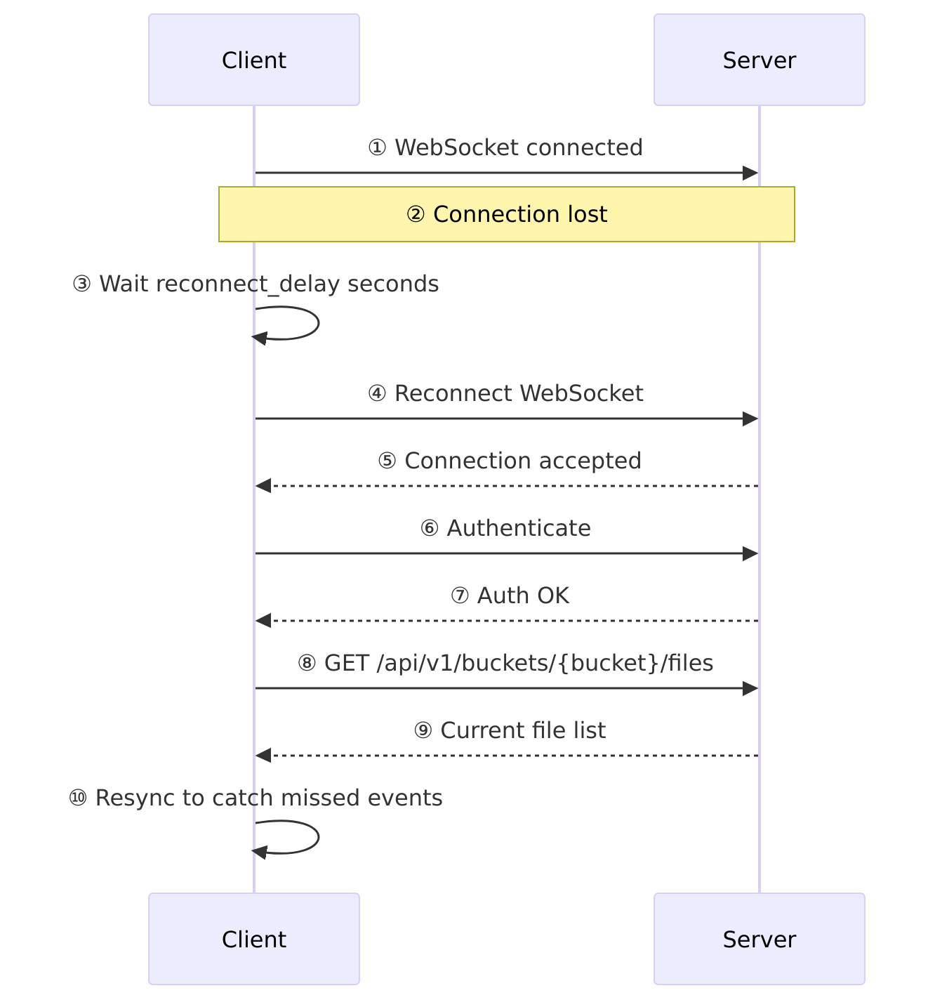
